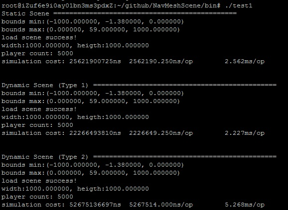
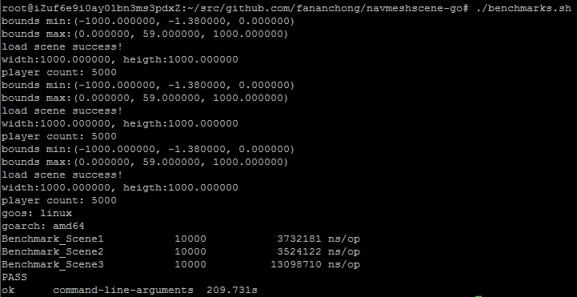

# navmeshscene-go

将 https://github.com/fananchong/NavMeshScene 翻译成 golang 版本

## 基准测试

C++：

Golang：

相关内容   | 说明
--------- | -----------------------------------
场景大小   | 1000 * 1000
游戏对象数 | 5000
AOI半径    | 0.6
一次op     | 所有游戏对象都做一次移动

**测试机器配置**

阿里云ECS服务器，配置： 1 vCPU 2 GB (I/O优化) ecs.t5-lc1m2.small 1Mbps
